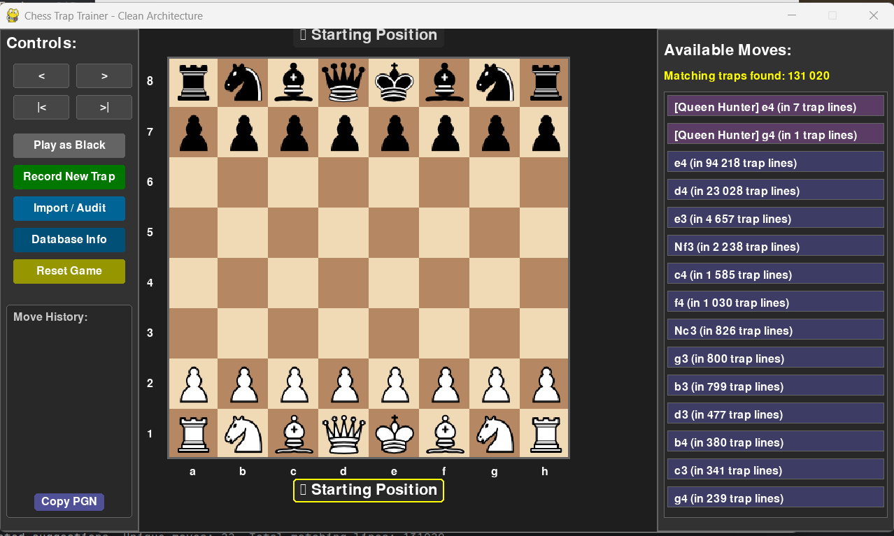

# ♟️ Chess Trap Trainer

**Chess Trap Trainer** este o aplicație desktop avansată, dezvoltată în Python, concepută pentru a ajuta jucătorii de șah să învețe, să practice și să exploreze o varietate largă de capcane tactice și deschideri.

 

## ✨ Funcționalități Principale

### 🎯 **Antrenament Inteligent și Contextual**
- **Sistem Dual de Capcane**: Aplicația gestionează două tipuri de repertorii:
    1.  **Biblioteca Principală (PGN)**: O bază de date masivă, populată prin scanarea a mii de partide, axată pe capcane care duc la șah-mat.
    2.  **Repertoriul Custom (Înregistrat Manual)**: Capcanele tale personale, înregistrate direct în aplicație, care pot viza atât **șah-mat**, cât și **câștiguri materiale decisive** (ex: capturarea reginei, furci regale).
- **Sugestii în Timp Real**: Pe măsură ce joci, aplicația îți arată cele mai promițătoare continuări din ambele repertorii, prioritizând capcanele custom.
- **Diferențiere Vizuală Clară**:
    - 🟪 **Mov**: Sugestii din repertoriul tău custom (ex: `[Queen Hunter]`).
    - 🟦 **Albastru**: Sugestii din biblioteca principală de maturi.
- **Evidențiere Tactică**:
    - 🟥 **Roșu**: Evidențiază mutarea sugerată când selectezi o capcană din listă.
    - 🟩 **Verde**: Evidențiază răspunsul așteptat al adversarului, ajutându-te să exersezi continuarea corectă.
- **Recunoașterea Transpozițiilor**: Sistemul identifică poziția de pe tablă, nu doar secvența de mutări. Chiar dacă ajungi la o poziție printr-o ordine diferită de mutări, vei primi sugestiile corecte.
- **Bază de Date a Deschiderilor**: Afișează în timp real numele deschiderii care se joacă (ex: "Sicilian: Najdorf") și recunoaște sisteme de joc precum "London System" sau "King's Indian Defense".

### ✍️ **Mod de Înregistrare Flexibil și Puternic**
- **Înregistrare Contextuală**: Butonul "Record" are funcționalitate duală:
    1.  **De la Zero**: Pornește o sesiune de înregistrare pe o tablă goală pentru a introduce o linie nouă.
    2.  **Salvarea unui Joc Curent**: Dacă ești în mijlocul unui joc interesant, poți apăsa "Record" pentru a salva direct istoricul partidei curente ca o nouă capcană.
- **Analiză Automată**: La finalul înregistrării, sistemul detectează automat tipul de capcană:
    - Șah-mat (`Checkmate`)
    - Captură directă de regină (`Direct Queen Capture`)
    - Furcă regală (rege + regină) (`Royal Fork`)
- **Control Total**: Un dialog de confirmare îți permite să **Salvezi**, să **Anulezi** sau să **Continui** înregistrarea.
- **Navigare în Timpul Înregistrării**: Poți folosi butoanele de `back` și `forward` pentru a corecta greșeli în timpul înregistrării, fără a o lua de la capăt.

### 🗃️ **Management Avansat al Datelor**
- **Flux de Lucru Fără Blocaje**: Salvarea capcanelor custom este **instantanee**. Adăugarea se face dinamic în memoria aplicației, fără a bloca interfața.
- **Import Masiv de PGN-uri**: Importă zeci de mii de capcane de mat din fișiere PGN (inclusiv de pe Lichess, chess.com, etc.). Procesul este extrem de rapid, folosind toate nucleele procesorului.
- **Gestionare Bază de Date**:
    - **Import**: Dintr-un singur fișier PGN sau dintr-un folder întreg.
    - **Audit DB**: Curăță și repară biblioteca principală (elimină duplicate, corectează culorile, șterge intrările invalide).
    - **Manage Custom Traps**: O interfață dedicată pentru a vizualiza și șterge selectiv capcanele înregistrate manual.
    - **Database Info**: O fereastră de statistici care afișează separat numărul de capcane din bibliotecă și cele din repertoriul tău custom.
- **Caching Inteligent pe Două Niveluri**:
    - `trap_index.cache`: Cache-ul mare pentru biblioteca PGN. Se reconstruiește (proces lent) doar după un import sau audit.
    - `queen_trap_index.cache`: Cache-ul mic și rapid pentru capcanele custom. Se reconstruiește **instantaneu** la fiecare modificare.

## 🛠️ Arhitectură Software

Aplicația este construită folosind principii de **Clean Architecture**, separând clar responsabilitățile în straturi distincte pentru o mentenanță și extindere ușoară:
- **UI (Interfață Utilizator):** `Renderer`, `InputHandler`, și clase `Qt...` pentru ferestrele de dialog.
- **Controller (`GameController`):** Ordonează fluxul de date și gestionează starea aplicației.
- **Services (Servicii):** `TrapService` (bibliotecă PGN), `QueenTrapService` (capcane custom), `PGNImportService`, `DatabaseAuditor`, `OpeningDatabase`.
- **Repository (`TrapRepository`, `QueenTrapRepository`):** Strat de abstractizare peste tabelele din baza de date SQLite.
- **Entities (Entități):** `GameState`, `ChessTrap`, `QueenTrap`, `MoveSuggestion`, etc.

## 🚀 Instalare

Pentru a rula acest proiect, vei avea nevoie de Python 3.8 sau o versiune mai nouă.

1.  **Clonează repository-ul:**
    ```bash
    git clone https://github.com/your-username/chess-trap-trainer.git
    cd chess-trap-trainer
    ```

2.  **Creează un mediu virtual (recomandat):**
    ```bash
    python -m venv venv
    ```
    *   Pe Windows, activează-l cu: `.\venv\Scripts\activate`
    *   Pe macOS/Linux, activează-l cu: `source venv/bin/activate`

3.  **Instalează dependențele:**
    Fișierul `requirements.txt` conține toate pachetele necesare.
    ```bash
    pip install -r requirements.txt
    ```

4.  **Imagini piese (opțional):**
    Asigură-te că ai un folder numit `pieces` în directorul rădăcină, care conține imaginile pieselor de șah în format PNG (ex: `wp.png` pentru pion alb, `bn.png` pentru cal negru). Dacă folderul sau imaginile lipsesc, programul va afișa piese simple, geometrice.

### 📁 Structura Proiectului
```
chess-trap-trainer/
├── Chess_trap_explorer.py  # Scriptul principal al aplicației
├── chess_traps.db          # Baza de date SQLite (se creează automat)
├── trap_index.cache        # Cache pentru biblioteca PGN (se creează automat)
├── queen_trap_index.cache  # Cache pentru capcanele custom (se creează automat)
├── requirements.txt        # Lista de dependențe
├── pieces/                 # Folder cu imaginile pieselor
│   ├── wK.png, wQ.png, ...
│   └── bK.png, bQ.png, ...
└── README.md
```

## 📖 Utilizare

Pentru a porni aplicația, rulează scriptul principal:
```bash
python Chess_trap_explorer.py
```

### Flux de lucru recomandat:

1.  **Populează Biblioteca Principală (Opțional):** Dacă dorești un repertoriu vast de maturi, mergi la `Controls` -> `Import / Audit`. Selectează un fișier PGN sau un folder și pornește importul.
2.  **Începe Antrenamentul:** Aplicația pornește direct într-un joc. Folosește butonul "Play as White/Black" pentru a schimba culoarea. Butonul "Reset Game" începe o partidă nouă cu aceeași culoare.
3.  **Explorează și Învață:**
    *   Fă mutări pe tablă.
    *   Panoul din dreapta îți va arăta sugestii, cu cele custom (mov) având prioritate.
    *   Click pe o sugestie pentru a o evidenția pe tablă. Fă mutarea și observă highlight-ul verde care indică răspunsul probabil al adversarului.
4.  **Creează-ți Repertoriul:**
    *   Apasă "Record New Trap" pentru a intra în modul de înregistrare pe o tablă goală.
    *   Joacă linia dorită (poți folosi butoanele de navigație pentru a corecta).
    *   Apasă "Confirm/Stop" și alege să salvezi. Capcana va fi disponibilă instantaneu.
    *   Dacă ai jucat o linie interesantă într-un joc normal, apasă "Record New Trap" pentru a o salva direct.

## 📦 Dependențe

Proiectul se bazează pe următoarele biblioteci Python:

*   `pygame`: Pentru motorul grafic și interfața principală a tablei de șah.
*   `python-chess`: Pentru toată logica de șah (mutări, validări, PGN, FEN).
*   `PySide6`: Pentru ferestrele de dialog native (import, mesaje de confirmare, statistici).
*   `pyperclip`: Pentru funcționalitatea butonului "Copy PGN".

## 🤝 Contribuții

Contribuțiile sunt binevenite! Te rog să respecți următorul flux de lucru:
1.  **Fork** acest repository.
2.  **Creează** o nouă branch pentru funcționalitatea ta (`git checkout -b feature/NumeFeature`).
3.  **Commit** modificările tale (`git commit -am 'Add some feature'`).
4.  **Push** către branch (`git push origin feature/NumeFeature`).
5.  **Deschide** un Pull Request.

---

**Mult succes la șah!**